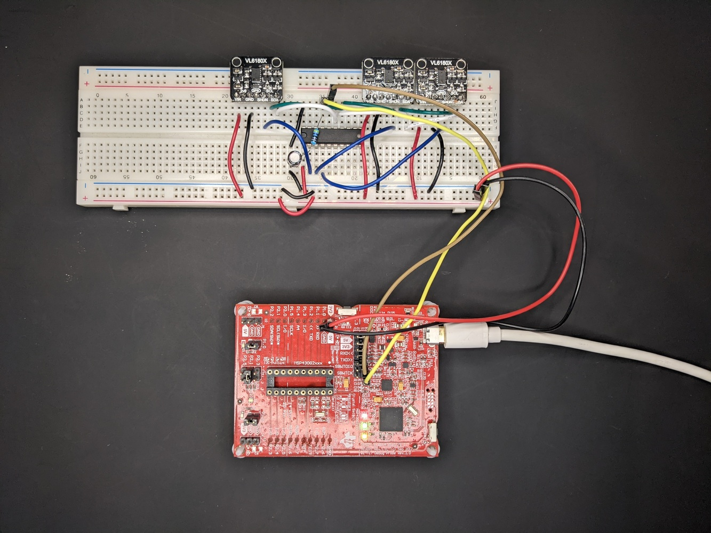
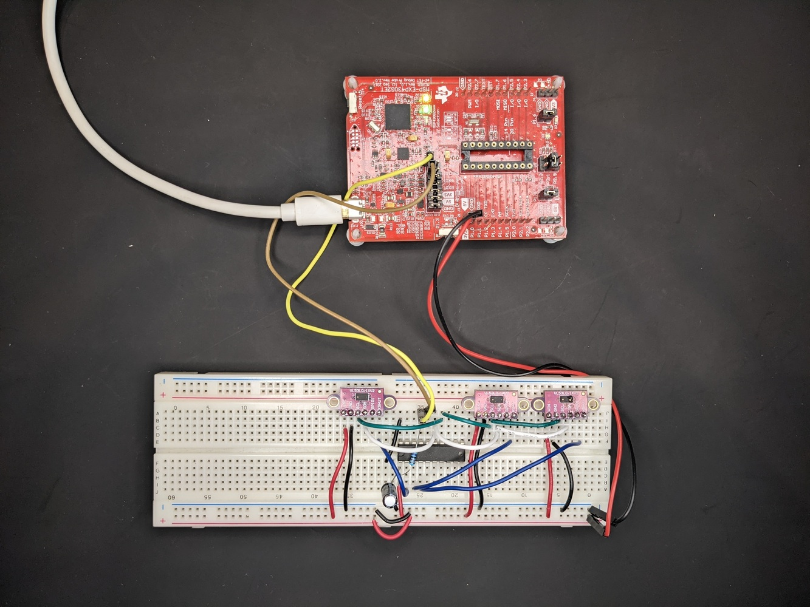

# VL6180X and VL53L0X drivers with an MSP430 I2C driver
Some of the tiniest and most affordable range sensors on the market today are the time-flight sensors from ST,
including VL6180X (0-10 cm) and VL53L0X (0-200 cm), among others. These have an I2C interface, and ST provides
an API suite to help you quickly get going. Unfortunately, this API suite is a bit bloaty, and if you are like me,
you want to keep your memory footprint small and your code clean. Therefore, I have created new lightweight
drivers from scratch in this repo. I verified these drivers on an MSP430, and this repo also contains the
MSP430-specific I2C driver, but it's straightforward to switch out this driver if you want to port the sensor
drivers to another microcontroller.

This are two accompanying blog posts for this repo:
* [How to write a microcontroller for an I2C device? (MSP430 and VL6180X)](https://www.artfulbytes.com/mcu-i2c-driver)
* [Writing a driver for the tiny range sensor VL53L0X (0-200 cm)](https://www.artfulbytes.com/vl53l0x-post)

## Features...
* VL6180X driver
    - Lightweight
    - Portable
    - Multi-sensor support
* VL53L0X driver
    - Lightweight
    - Portable
    - Multi-sensor support
    - SPAD configuration
* MSP430 I2C driver
    - Read and write 8/16/32-bit address/data register sizes
    - Read and write byte array
    - Reuseable for other I2C devices

## Limitations
This repository aims to demonstrate I2C and to provide the bare minimum to do
range measuring with VL6180X and VL53L0X, which means it has certain limitations:
* Everything is done by polling (no interrupts)
* No error handling or recovery
* VL53L0X driver lacks full SPAD management support
* Only single mode (not continuous)
* Single ranging profile

# Setup
If you are on an MSP430, you can create a new project and pull in the files from this repo and build.
You may have to modify the defines depending on which and how many sensors you are using. If you are
on another microcontroller, you need to replace the i2c.c with your implementation. Hardware-wise,
make sure you connect the SDA, SCL, and XSHUT pin. Examples with breakout boards:

Hardware-wise, make sure you connect the SDA, SCL and XSHUT pin.
Examples with MSP430 and breakout boards:

Note, the commit history follows the progress in the blog posts, and I have verified
each commit on target. So if you want to try the differnet steps yourself you can
use _git rebase -i --root_ to step through the history.

Once again, read the blog posts for more details.

# Resources
Have a look at these accompanying blog posts:

* [How to write a microcontroller for an I2C device? (MSP430 and VL6180X)](https://www.artfulbytes.com/mcu-i2c-driver)
* [Writing a driver for the tiny range sensor VL53L0X (0-200 cm)](https://www.artfulbytes.com/vl53l0x-post)

They also contain additional resources.
